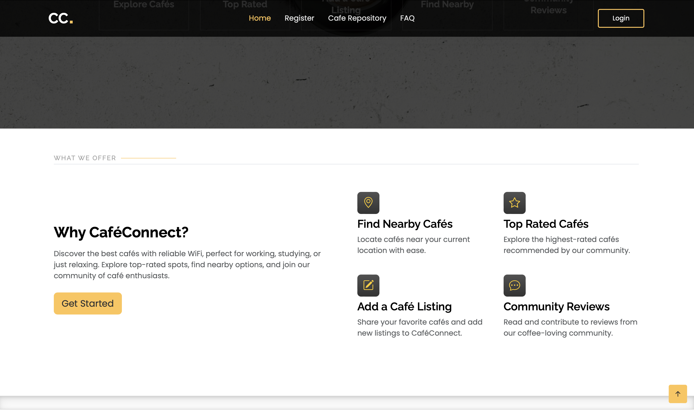
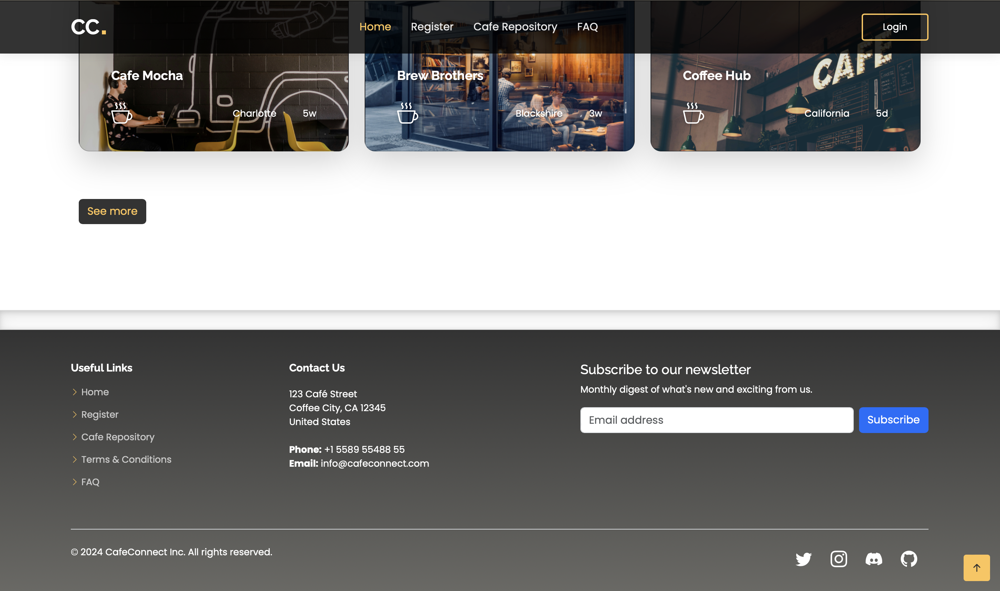
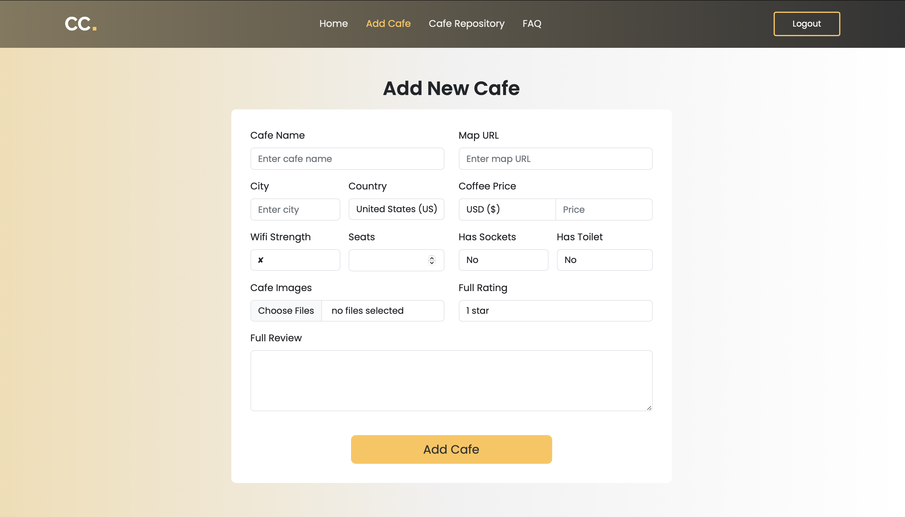
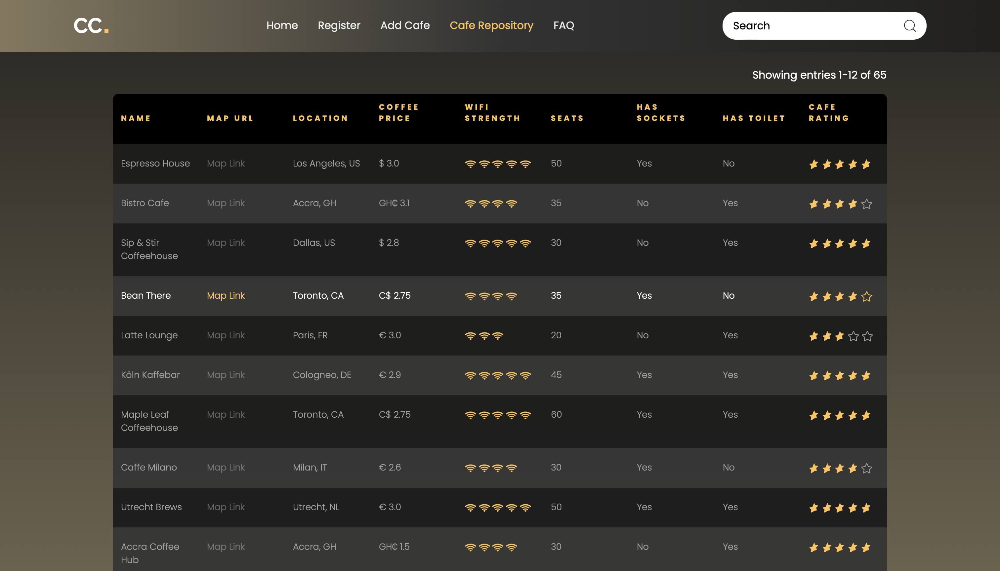

# CafeConnect

Welcome to **CafeConnect**! This project is a hub for coffee enthusiasts and remote workers, providing a platform where users can discover cafes with the best amenities for working on the go. Whether you're looking for strong WiFi, a cozy atmosphere, or a good cup of coffee, Cafe Connect is here to help you find the perfect spot.

## Features

- **User Authentication**: Secure login and registration.
- **Cafe Listings**: Browse a curated list of cafes with details on amenities, WiFi strength, and more.
- **Find Nearby Cafes**: Discover cafes in your vicinity for convenience and ease.
- **Add Cafes**: Allows users to add new cafes to the platform, contributing to a growing and diverse list of coffee spots.
- **Featured Top-Rated Cafes**: Highlights the best cafes based on user ratings and reviews.
- **API Access**: Access cafe data via a RESTful API for management and integration with other applications.

### Planned Features
Upcoming features in the future:

- **Community Reviews**: Users will be able to leave and read reviews of cafes to help others find the best spots.
- **Personalized Recommendations**: Cafe suggestions based on user preferences.
- **Interactive Map**: An interactive map to visualize cafe locations and see nearby options.
- **Cafe Gallery**: Each cafe will display a gallery of images to provide users with a visual overview of the ambiance, amenities, and more. Images will be contributed by admins and users, making the experience more community-driven.

Stay tuned!

## Tech Stack

- **Flask**: Backend framework.
- **Bootstrap & Javascript**: UI design and interactive front-end.
- **SQLAlchemy**: ORM for database management.
- **Flask-WTF**: Form handling and validation.
- **Flask-Login**: User session management.
- **SQLite**: Database for storing cafe and user data.
- **Flask-RESTful**: API creation and management.


## Getting Started

1. **Clone the Repository**
   ```bash
   git clone https://github.com/ser-arthur/cafe-connect-website.git
   cd cafe-connect-website
   ```

2. **Create a Virtual Environment**
   ```bash
   python -m venv venv
   source venv/bin/activate  # Windows: `venv\Scripts\activate`
   ```

3. **Install Requirements**
   ```bash
   pip install -r requirements.txt
   ```

4. **Run the Application**
   ```bash
   python run.py
   ```

   The application will be accessible at:
   ```bash
   http://localhost:5000/    # localhost address may differ depending on your system configuration
   ```

## Live Deployment

The application is also deployed and accessible online at [CafeConnect](https://cafe-connect.vercel.app).

<br>

<table>
    <tr>
        <td></td>
    </tr>
    <tr>
        <td></td>
    </tr>
    <tr>
        <td></td>
    </tr>
    <tr>
        <td></td>
    </tr>
    <tr>
        <td></td>
    </tr>
    <tr>
        <td></td>
    </tr>
</table>


## API Documentation
Check the [API](API.md) file for details on using the API.

## Contributing

Feel free to contribute to the project by submitting issues or pull requests.

## License

This project is licensed under the AGPL-3.0 License - see the [LICENSE](LICENSE.txt) file for details.

## Author
**Kobby S. Arthur**
